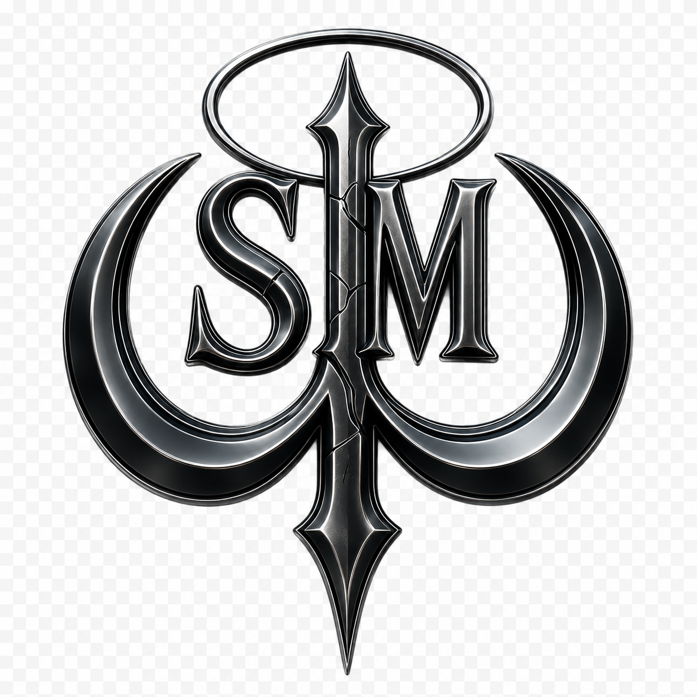

# CRYBABY404

Building local-first AI systems where memory, provenance, and machine decisions remain visible to the human operator.

*Most systems optimize recall. **Technemachina asks what deserves to become memory.***

---

## Technemachina

[Technemachina](https://github.com/SiMULACRA-Studios/technemachina) is a local-first AI architecture and research system exploring:

- governed memory states: candidate, contested, approved, revoked, and decayed
- provenance-aware knowledge loading
- auditable decision traces
- inspectable provider routing
- bounded companion intelligence
- human-authorized automation
- visual knowledge constellations through Synapse

Memory is treated as governed state—not silently accumulated context.

## Current Focus

Developing ownership-aware Synapse views, companion-safe knowledge boundaries, regression-tested projections, and human-centered interfaces for inspecting machine memory.

## Stack

`Python` · `FastAPI` · `JavaScript` · `HTML/CSS` · `Git`

---

Founder of [SiMULACRA Studios](https://github.com/SiMULACRA-Studios)—an independent creative technology studio connecting AI systems, music, visual worldbuilding, and interface design.

**Intelligence should remain legible to the person it serves.**

[simulacracc@gmail.com](mailto:simulacracc@gmail.com)

  

